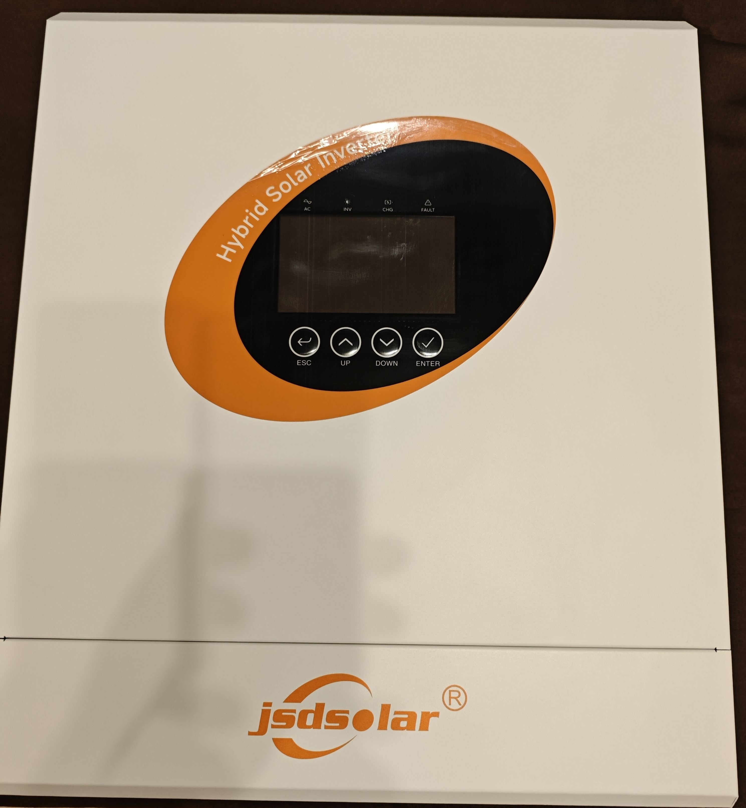
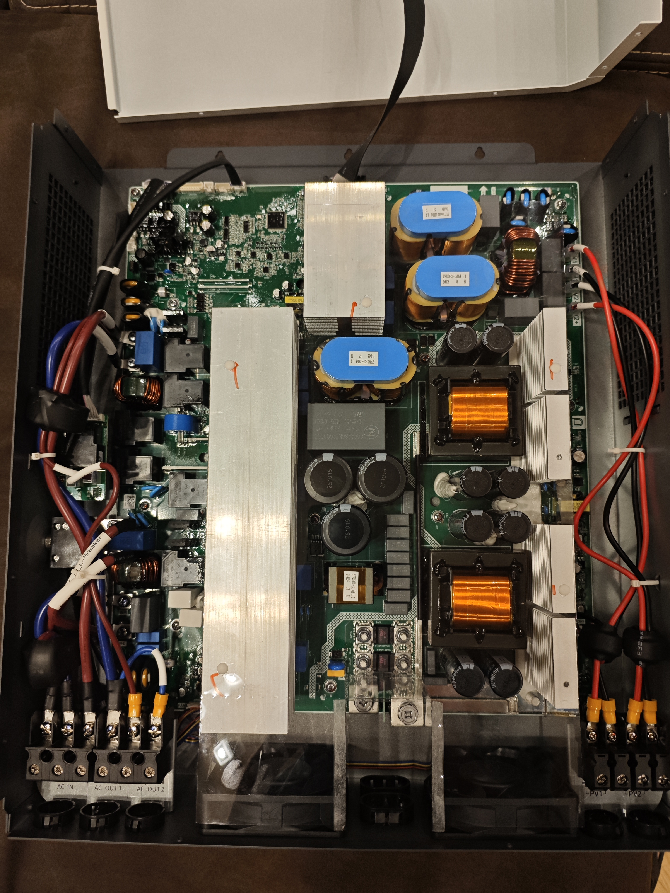
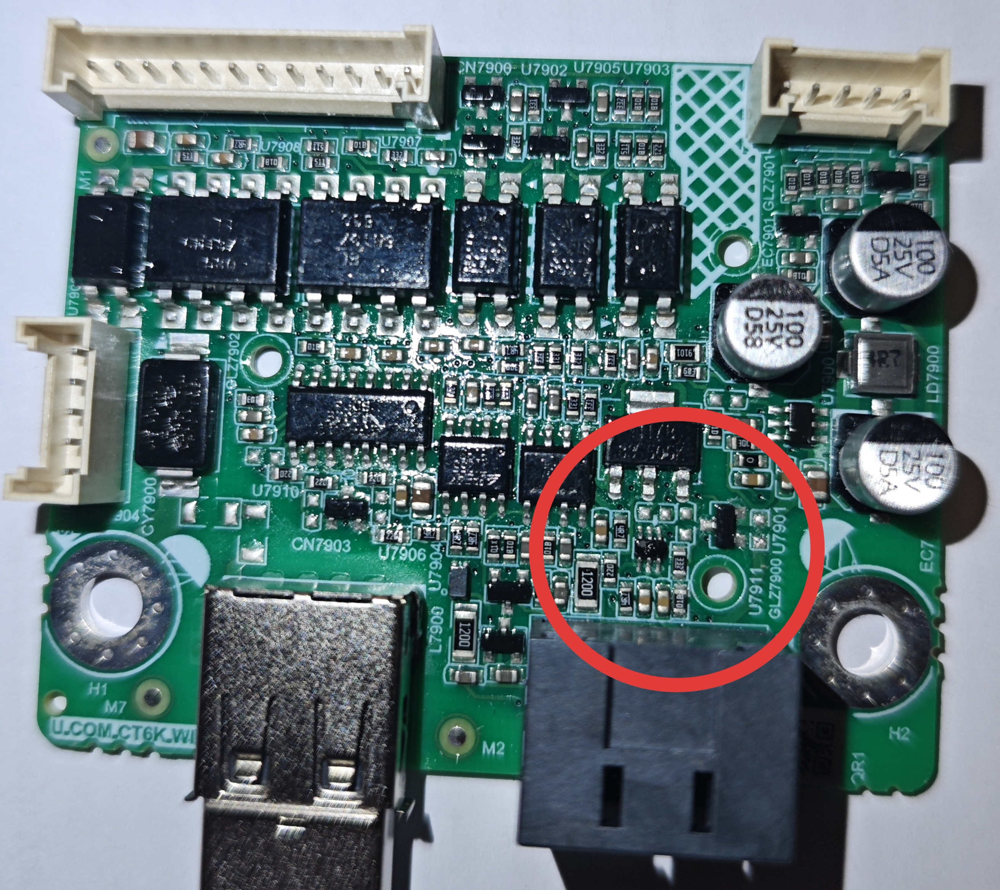
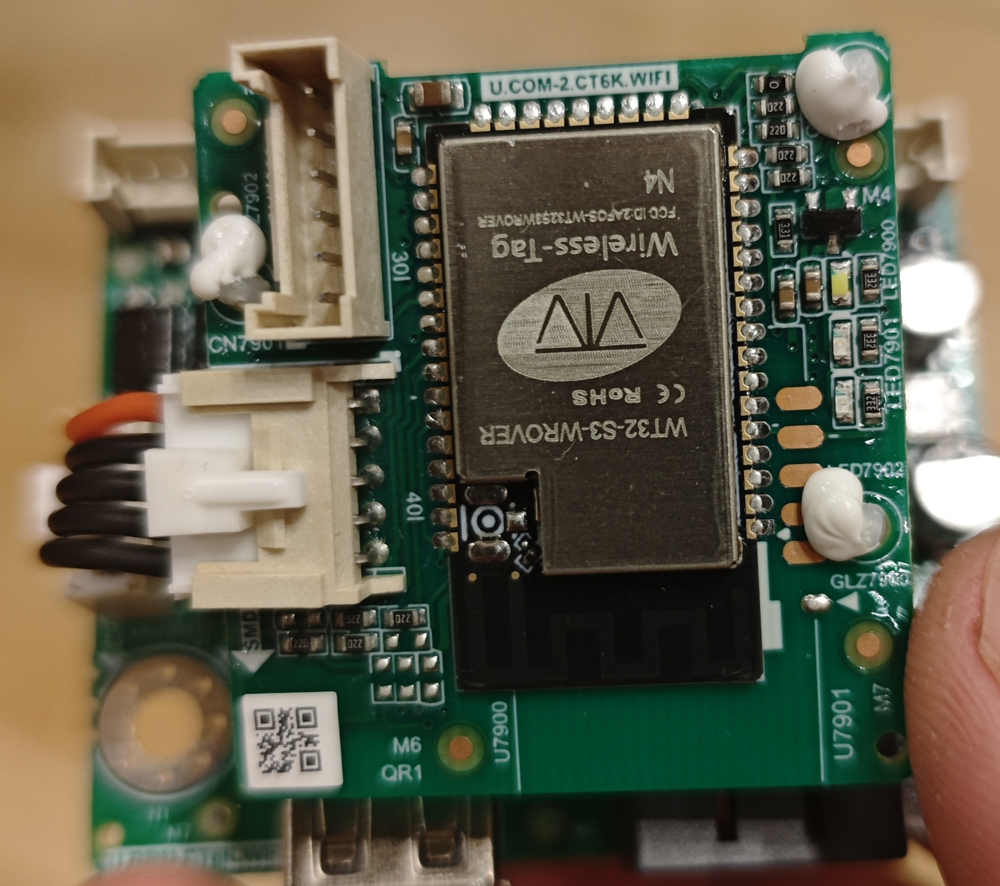

# ESPHome configuration for JSD Solar Inverter – Modbus RTU logger

 


## Compatibility
- JSDSolar Hybrid Inverter j12000HC-48 12kW 48V
- Anern Solar Inverter AN-FGI-S12000 12kW 48V
- Anern Solar Inverter AN-FGI-S6500 6.5kW 48V
- Anern Solar Inverter AN-FGI-P6500 6.5kW 48V
- Anern Solar Inverter AN-FGI-P5000 5kW 24V
- ECGSolax Hybrid Solar Inverter ECG-HVM6.5KP-48V

### Tested models

## Connection
1) Use ESP32-S3 connected via RS232 comverter pluged into "USB" port of inverter (marked as COMM or WIFI). Ensure 3.3v from ESP32-S3 is connected to 3.3v pin of the RS232 converter. 
Please check pinout and DC voltage on "USB" port before connecting ESP32-S3. The DC voltage on this port is 5V or 12V depending on the model, which can damage ESP32-S3. So DC-DC converter like 360mini should be used to step down the voltage to 3.3V. Please double check the pinout of the converter before connecting to ESP32-S3.
Inverter Models with internal wifi loger do not have DC voltage on "USB" port. In this case you need to modify inverter communication board. 
  
  

2) Inverter Models with internal wifi loger use WT32-S3-Wrover modules connected internally, you can flash it instead of  external ESP32-S3. it is recomended to dump original firmware prior to flashing ESPHome firmware. it is needed to put GPIO0 to GND to start download/flash wirmware. it is needed USB to TTL adapter to download/flash wirmware.

there are 2 connectors on T32-S3-Wrover logger board:

- CN7900- HY2.0 6PIN - for upload firmware
  - 1-VCC 3.3V
  - 2-GND
  - 3-EN
  - 4-TX
  - 5-RX
  - 6-GPIO0 (it is needed to put LOW to start flash wirmware)

- CN7901- HY2.0 5PIN - for serial comunications with invertor TTL level signals
  - 1-GPIO39 as a TX
  - 2-GPIO38 as a RX
  - 3-VCC 3.3V
  - 4-EN
  - 5-GND

  

3) Also it is possible to connect ESP32-S3 instead of WT32-S3-Wrover directly see pinouts of CN7901 for proper connection. No need to use RS232 and DC-DC comverter in that case. for inverters without internal logger you need to modify the communication board.


## Usage
1) Create new ESPHome device, within your ESPHome (let it be `my-inverter`, for example) 
2) Copy the contents of the `jsd-solar-inverter.yaml`  to a config file of newly created deivce.
3) Please be sure that all secret variables defined in `jsd-solar-inverter.yaml` are present in your `secrets.yaml`. if something is missed, it should be added. Please use `secrets.yaml.template` as an example of `secrets.yaml`
4) chose proper TX, RX pins for your UART, Review and comment sensors that are not needed.
5) Flash firmware to your ESP32-S3


## Inverter card
For easy integration into Home Assistant, you can use the examples of inverter cards. 
The following custom plugins are required: [sunsynk-power-flow-card](https://github.com/slipx06/sunsynk-power-flow-card), [stack-in-card](https://github.com/custom-cards/stack-in-card).

## Optimize modbus communications
ESPHome reads sequential Modbus registers in one batch. If you have gaps in register addresses, you need to use the `register_count` parameter to skip N registers and continue the batch.
[Details in ESPHome docs](https://esphome.io/components/sensor/modbus_controller#modbus-register-count).

You can debug your register ranges by setting the global log level to `VERBOSE` and muting all "noisy" components except the `modbus_controller`.
```yaml
logger:
  level: VERBOSE
  logs:
    component: ERROR # Fix for issue #4717 "Component xxxxxx took a long time for an operation"
    modbus_controller: VERBOSE
    modbus_controller.text_sensor: WARN
    modbus_controller.sensor: WARN
    modbus_controller.binary_sensor: WARN
    modbus_controller.select: WARN
```

## UART debugging
-  to enable the debug output of the UART component 
  ```
    # debug:
    #   direction: BOTH
    #   dummy_receiver: false
  ```
- Increase the log level to `DEBUG` or `VERBOSE`
  ```
  logger:
    level: WARN
  ```

## Notes
- Registers map: [registers-map.md](docs/registers-map.md )
- Excel source: [INV-Modbus地址表3KU（外发）V1.20.xlsx](docs/INV-Modbus地址表3KU（外发）V1.20.xlsx)  
